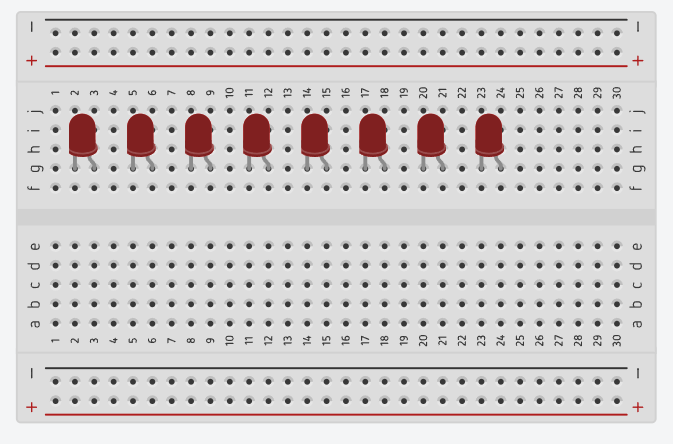

# Running LEDs

  

## Requirements

- ให้มี LED จำนวน 8 ดวง
- LED ทุกดวง ต้องต่อตัวต้านทานที่เหมาะสม **มิฉะนั้นจะไม่ตรวจ**
- เมื่อเริ่มการทำงาน ให้แสดงผล LED วิ่ง ไป-กลับ (LED ติดครั้งละ 1 ดวง) โดยเริ่มจาก LED ดวงด้านซ้ายสุด
- ระยะห่างระหว่างการติด-ดับ ของ LED แต่ละดวง ให้ห่างกันครั้งละ 500ms
- ให้ LED วิ่งไปเรื่อย ๆ จนกว่าจะมีการปิด Arduino หรือถอดแหล่งพลังงานออก
