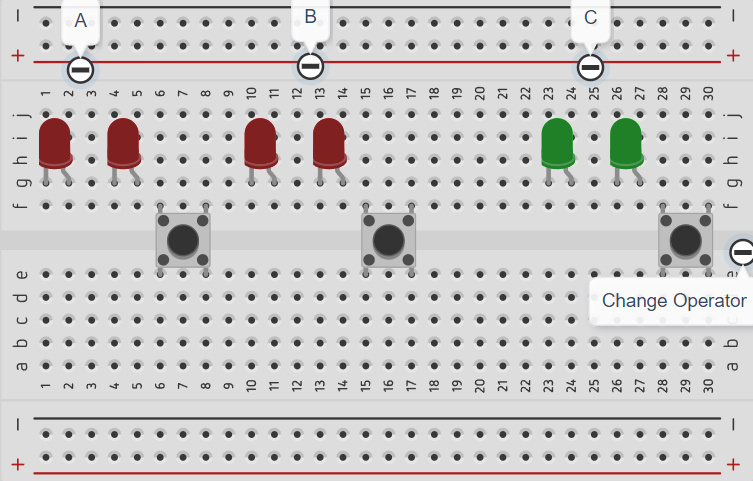

# Logic Gate

Logic gates เป็นวงจรพื้นฐานที่ใช้ในการประมวลผลทางดิจิทัล โดยจะรับสัญญาณ Input และให้ผลลัพธ์ตามหลักการทางตรรกะ (Boolean Logic) มีประเภทหลัก ๆ ดังนี้:

| Logic Gate | Description                                   | Truth Table Example  |
|------------|-----------------------------------------------|--------------------------------|
| AND        | ให้ผลลัพธ์เป็น 1 เมื่ออินพุตทุกตัวเป็น 1       | A = 1, B = 1 → Output = 1      |
| OR         | ให้ผลลัพธ์เป็น 1 เมื่อมีอินพุตอย่างน้อย 1 ตัวเป็น 1 | A = 1, B = 0 → Output = 1      |
| NOT        | ให้ผลลัพธ์ตรงข้ามกับอินพุต                   | A = 1 → Output = 0             |
| NAND       | ให้ผลลัพธ์ตรงข้ามกับ AND Gate                | A = 1, B = 1 → Output = 0      |
| NOR        | ให้ผลลัพธ์ตรงข้ามกับ OR Gate                 | A = 0, B = 0 → Output = 1      |
| XOR        | ให้ผลลัพธ์เป็น 1 เมื่ออินพุตต่างกัน           | A = 1, B = 0 → Output = 1      |
| XNOR       | ให้ผลลัพธ์เป็น 1 เมื่ออินพุตเหมือนกัน        | A = 1, B = 1 → Output = 1      |

Logic gates เป็นพื้นฐานของการออกแบบวงจรดิจิทัล เช่น คอมพิวเตอร์และอุปกรณ์อิเล็กทรอนิกส์ต่าง ๆ

## Requirement

ให้ต่อวงจรและเขียนโปรแกรมลงบน Arduino เพื่อจำลองการทำงานของ Logic Gate 4 ชนิด คือ AND, OR, XOR และ NOT โดยมีรายละเอียดต่อไปนี้

### LED Display

- ให้มี LED จำนวน 3 ชุด ชุดละ 2 ดวง รวมเป็น 6 ดวง
- LED ทุกดวง ต้องต่อตัวต้านทานที่เหมาะสม **มิฉะนั้นจะไม่ตรวจ**
- ให้ LED ชุดที่ 1 และ 2 แสดงผล Input จำนวน 2 บิต จำนวน 2 ชุด (A และ B)
- ให้ LED ชุดที่ 3 แทนผลลัพธ์ของการทำ Operation ระหว่าง Input ทั้งสอง (C)
- สำหรับ LED แต่ละชุด ให้ LED ด้านขวามือสุด เป็น LSB และ LED ด้านซ้ายมือสุดเป็น MSB
- บิต `0` แทน LED ดับ
- บิต `1` แทน LED ติด

### Control

- ให้มีปุ่ม Push Button จำนวน 3 ปุ่ม โดยต่อวงจรแบบ Pull Up หรือ Pull Down ก็ได้ (ไม่อนุญาตใช้ใช้ INPUT_PULLUP)
- Push Button จำนวน 2 ปุ่ม ใช้ควบคุม Input A และ B โดยเมื่อเริ่มต้นการทำงาน `A = B = 0`
- เมื่อกดปุ่ม Push Button ที่ใช้ควบคุม Input A และ B จะเพิ่มค่าของ A และ B ครั้งละ 1 และแสดงผลทาง LED (00 -> 01 -> 10 -> 11 -> 00 -> ...)
- Push Button ปุ่มที่ 3 ใช้สำหรับเลือก Operator ที่ต้องการ โดยเมื่อเลือก Operator แล้ว จะแสดงผลลัพธ์ที่ได้จากการดำเนินการระหว่าง A และ B โดยใช้ Operator ที่เลือก ผ่าน LED (C)
- การเลือก Operator ผ่าน Push Button ปุ่มที่ 3 เป็นแบบ Circular คือ เมื่อกดปุ่ม จะเป็น Operator วนไปเรื่อย ๆ ตามลำดับ ดังนี้
  - AND (A AND B)
  - OR (A OR B)
  - XOR (A XOR B)
  - NOT (NOT A)
- Push Button ทุกปุ่ม ต้องทำการ Debounce **มิฉะนั้นจะไม่ตรวจ**

## Example Diagram

## Example Testcase

|  A  |  B  | A AND B | A OR B | A XOR B | NOT A |
|:---:|:---:|:-------:|:------:|:-------:|:-----:|
| 10  | 00  |   00    |   10   |   10    |  01   |
| 10  | 01  |   00    |   11   |   11    |  01   |
| 10  | 10  |   10    |   10   |   00    |  01   |
| 10  | 11  |   10    |   11   |   01    |  01   |
| 01  | 00  |   00    |   01   |   01    |  10   |
| 01  | 01  |   01    |   01   |   00    |  10   |
| 01  | 10  |   00    |   11   |   11    |  10   |
| 01  | 11  |   01    |   11   |   10    |  10   |
| 00  | 00  |   00    |   00   |   00    |  11   |
| 00  | 01  |   00    |   01   |   01    |  11   |
| 00  | 10  |   00    |   10   |   10    |  11   |
| 00  | 11  |   00    |   11   |   11    |  11   |
| 11  | 00  |   00    |   11   |   11    |  00   |
| 11  | 01  |   01    |   11   |   10    |  00   |
| 11  | 10  |   10    |   11   |   01    |  00   |
| 11  | 11  |   11    |   11   |   00    |  00   |

## Warning

- Solution ที่ให้ไว้ในข้อนี้ ไม่ได้ทำการ Debounce ด้วยวิธีที่เหมาะสม