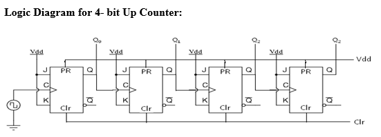

# 4 Bits Counter

วงจรเคาน์เตอร์ (Counter Circuit) เป็นวงจรดิจิทัลที่ใช้ในการนับจำนวนครั้งของเหตุการณ์ที่เกิดขึ้นตามสัญญาณนาฬิกา (Clock) โดยจะมีการเก็บค่าตัวเลขในรูปแบบของ Binary และแสดงผลลัพธ์ตามจำนวนบิตที่กำหนด

## Requirement

ให้ต่อวงจรและเขียนโปรแกรมลงบน Arduino เพื่อจำลองการทำงานของวงจร Counter ขนาด 4 บิต โดยมีรายละเอียดต่อไปนี้

- ให้มี LED จำนวน 4 ดวง
- LED ทุกดวง ต้องต่อตัวต้านทานที่เหมาะสม **มิฉะนั้นจะไม่ตรวจ**
- LED แต่ละดวง แทนบิต 1 บิต ให้ LED ด้านซ้ายมือสุดเป็น MSB และ LED ด้านขวามือสุดเป็น LSB
- เมื่อเริ่มต้นการทำงาน วงจร Counter จะเริ่มที่ 0 (0b0000) และเมื่อนับจนถึง 15 (0b1111) แล้วจะกลับมาเริ่มนับใหม่ที่ 0 อีกครั้ง
- บิต `0` แทน LED ดับ
- บิต `1` แทน LED ติด
- **ให้ Clock Speed ในการนับเท่ากับ 1 Hz**

>> ถ้าทำข้อนี้เสร็จแล้ว ลองไปทำ [8 Bits Counting Machine](../04-8-bits-counting-machine/) ต่อเลย !