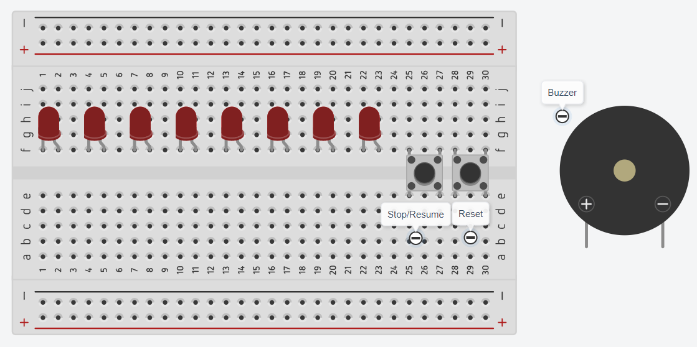

# 8 Bits Counting Machine

> ให้ทำข้อ [4 Bits Counter](../03-4-bits-counter/) ก่อน

  

## Requirement

ให้ต่อวงจรและเขียนโปรแกรมลงบน Arduino เพื่อจำลองการทำงานของวงจร Counter ขนาด 8 บิต โดยมีรายละเอียดต่อไปนี้

### LED Display

- ให้มี LED จำนวน 8 ดวง
- LED ทุกดวง ต้องต่อตัวต้านทานที่เหมาะสม **มิฉะนั้นจะไม่ตรวจ**
- LED แต่ละดวง แทนบิต 1 บิต ให้ LED ด้านซ้ายมือสุดเป็น MSB และ LED ด้านขวามือสุดเป็น LSB
- เมื่อเริ่มต้นการทำงาน วงจร Counter จะเริ่มที่ 0 (0b00000000) และเมื่อนับจนถึง 255 (0b11111111) แล้วจะกลับมาเริ่มนับใหม่ที่ 0 อีกครั้ง
- บิต `0` แทน LED ดับ
- บิต `1` แทน LED ติด
- **ให้ Clock Speed ในการนับเท่ากับ 2 Hz**

### Control  

- ให้มีปุ่ม Push Button จำนวน 2 ปุ่ม ให้ต่อวงจรแบบ Pull Up หรือ Pull Down **โดยที่เมื่อกดปุ่มจะทำให้มีสถานะเป็น HIGH** (ไม่อนุญาตใช้ใช้ INPUT_PULLUP)
- Push Button ทุกปุ่ม ต้องทำการ Debounce **มิฉะนั้นจะไม่ตรวจ**
- **Push Button ปุ่มที่ 1:** เมื่อกดแล้ว ให้หยุดวงจร Counter ทันที จนกว่าจะมีการกดซ้ำอีกหนึ่งครั้ง (Toggle) ให้นับต่อจากเดิม
- **Push Button ปุ่มที่ 2:** เมื่อกดแล้ว ให้ Reset Counter กลับไปเป็น 0 ทันที

### Terminate Count (TC)

- ให้มี Buzzer 1 ตัว
- Buzzer ทุกตัว ต้องต่อตัวต้านทานที่เหมาะสม **มิฉะนั้นจะไม่ตรวจ**
- ให้ Buzzer ดัง เมื่อ Counter มีค่าเป็น 0 (0b00000000)