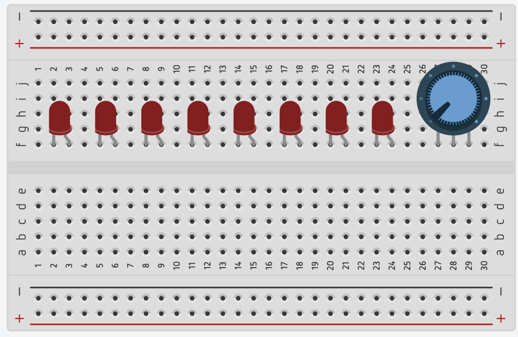

# Running LEDs v2 - Speed control

> ให้ทำข้อ [Running LEDs](../../1-easy/01-running-leds/) ก่อน

  

## Requirement

- ให้มี LED จำนวน 8 ดวง
- LED ทุกดวง ต้องต่อตัวต้านทานที่เหมาะสม **มิฉะนั้นจะไม่ตรวจ**
- เมื่อเริ่มการทำงาน ให้แสดงผล LED วิ่ง ไป-กลับ (LED ติดครั้งละ 1 ดวง) โดยเริ่มจาก LED ดวงด้านซ้ายสุด
- สามารถปรับความเร็วในการแสดงผล LED ได้ โดยใช้ **Potentiometer** โดยให้ delay อยู่ระหว่าง 50 - 1000 ms โดยประมาณ
- ให้ LED วิ่งไปเรื่อย ๆ จนกว่าจะมีการปิด Arduino หรือถอดแหล่งพลังงานออก