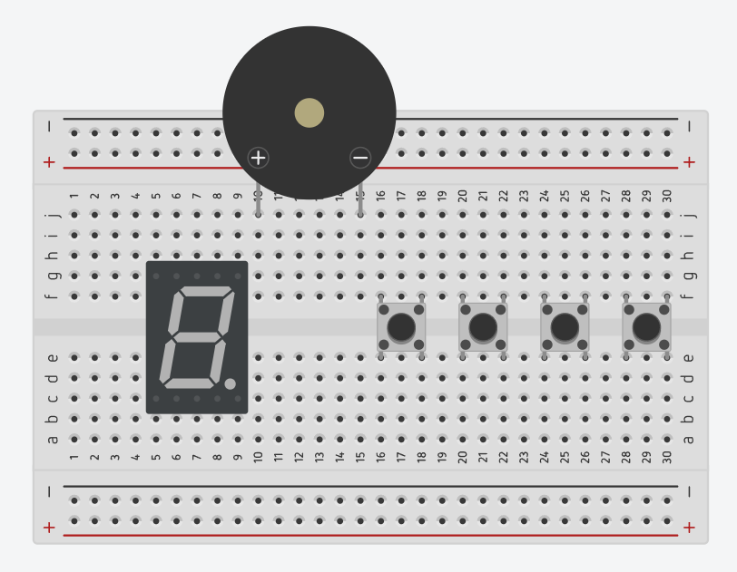
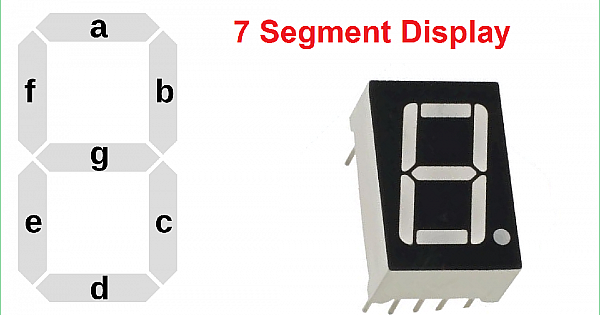

# BCD to 7 Segments Display Decoder

<p align="center">
  
</p>


**BCD** หรือ **Binary-Coded Decimal** เป็นวิธีการแทนเลขฐานสิบโดยใช้เลขฐานสอง เพื่อให้สามารถแสดงตัวเลขในระบบดิจิทัลได้อย่างเข้าใจง่ายขึ้น โดยแต่ละหลักในเลขฐานสิบจะถูกแทนด้วย 4 บิต ตัวอย่างเช่น:

| Decimal | BCD | Decimal | BCD |
|:-------:|:---:|:-------:|:---:|
|    0    | 0000 |    5    | 0101 |
|    1    | 0001 |    6    | 0110 |
|    2    | 0010 |    7    | 0111 |
|    3    | 0011 |    8    | 1000 |
|    4    | 0100 |    9    | 1001 |

ในระบบ BCD แต่ละตัวเลขทศนิยม (0-9) จะถูกแทนด้วยชุด 4 บิตเท่านั้น เช่น เลข 12 ในฐานสิบ จะเขียนเป็น BCD ได้โดยแยกแต่ละหลักดังนี้:

- เลข 1 แทนด้วย 0001
- เลข 2 แทนด้วย 0010

ดังนั้น 12 ใน BCD คือ 0001 0010

## BCD to 7 Segments Decoder

### การทำงาน

BCD to 7-Segment Decoder เป็นวงจรที่แปลงข้อมูลรหัส BCD (Binary-Coded Decimal) ให้เป็นรูปแบบที่สามารถแสดงตัวเลข 0-9 บนจอแสดงผลแบบ 7 ส่วน (7-segment display) ได้ โดย 7-segment display ประกอบด้วย 7 ส่วนหลัก (label ตั้งแต่ a ถึง g) ที่สามารถเปิด-ปิดได้เพื่อสร้างตัวเลขแต่ละตัวตามที่ต้องการ

การทำงานของ BCD to 7-Segment Decoder
Input: รับค่า BCD ซึ่งมีทั้งหมด 4 บิต (สามารถแทนค่าทศนิยมได้ตั้งแต่ 0-9)
Output: ให้ค่า output 7 บิตที่แสดงการเปิดหรือปิดของแต่ละส่วนบน 7-segment display (a-g)

### หลักการทำงาน

<p align="center">
  
</p>

ใน 7-segment display แต่ละ segment (a ถึง g) จะเปิดหรือปิดตามการควบคุมของ BCD to 7-Segment Decoder เพื่อแสดงตัวเลขให้ถูกต้อง ตัวอย่างเช่น:

- ตัวเลข 0 บน 7-segment display จะต้องเปิดทุก segment ยกเว้นส่วน g (a, b, c, d, e, f เปิด)
- ตัวเลข 1 เปิดเฉพาะส่วน b และ c
- ตัวเลข 2 เปิดส่วน a, b, g, e, d

การแสดงตัวเลขอื่น ๆ จะเปิด-ปิด segment ต่างกันตามรูปแบบของแต่ละตัวเลข

### ตารางการทำงานของ BCD to 7-Segment Decoder

ตารางด้านล่างนี้แสดงการแมปของ BCD (input) ไปยังส่วนต่าง ๆ ของ 7-segment display (output) สำหรับการแสดงตัวเลข 0-9:

| BCD Input (Decimal) | BCD Code | a | b | c | d | e | f | g |
|---------------------|----------|---|---|---|---|---|---|---|
| 0                   | 0000     | 1 | 1 | 1 | 1 | 1 | 1 | 0 |
| 1                   | 0001     | 0 | 1 | 1 | 0 | 0 | 0 | 0 |
| 2                   | 0010     | 1 | 1 | 0 | 1 | 1 | 0 | 1 |
| 3                   | 0011     | 1 | 1 | 1 | 1 | 0 | 0 | 1 |
| 4                   | 0100     | 0 | 1 | 1 | 0 | 0 | 1 | 1 |
| 5                   | 0101     | 1 | 0 | 1 | 1 | 0 | 1 | 1 |
| 6                   | 0110     | 1 | 0 | 1 | 1 | 1 | 1 | 1 |
| 7                   | 0111     | 1 | 1 | 1 | 0 | 0 | 0 | 0 |
| 8                   | 1000     | 1 | 1 | 1 | 1 | 1 | 1 | 1 |
| 9                   | 1001     | 1 | 1 | 1 | 1 | 0 | 1 | 1 |

หรือแสดงด้วย Code ภาษาซี ได้ดังนี้

```cpp
const uint8_t digitPatterns[10] = {
  0b00111111, // 0
  0b00000110, // 1
  0b01011011, // 2
  0b01001111, // 3
  0b01100110, // 4
  0b01101101, // 5
  0b01111101, // 6
  0b00000111, // 7
  0b01111111, // 8
  0b01101111  // 9
};
```

## Requirement

จงต่อวงจรและเขียนโปรแกรมลงบน Arduino เพื่อ**จำลองการทำงานของวงจร BCD to 7 Segments Display Decoder** โดยมีรายละเอียดดังต่อไปนี้

- ให้มีปุ่ม Push Button จำนวน 4 ปุ่ม แทนค่าของ BCD ในแต่ละหลัก โดยปุ่มทางด้านซ้ายมือสุดเป็น MSB และปุ่มด้านขวามือสุดเป็น LSB
- ให้ต่อปุ่ม Push Button แบบ PULLUP หรือ PULLDOWN โดยที่เมื่อกดปุ่มจะมีสถานะเป็น LOW และเมื่อปล่อยปุ่มจะมีสถานะเป็น HIGH (ไม่อนุญาตให้ต่อแบบ INPUT_PULLUP)
- ให้มี 7 Segments Display (SSD) จำนวน 1 ตัว
- SSD ทุกตัว ต้องต่อตัวต้านทานและ Common ที่เหมาะสม **มิฉะนั้นจะไม่ตรวจ**
- เมื่อกดปุ่ม Push Button แล้ว จะนำค่า BCD ที่ได้ ไปแสดงผลเป็นตัวเลขฐานสิบบน SSD ทันที เช่น
    - ปล่อย-ปล่อย-ปล่อย-ปล่อย (0000) -> แสดงผลเลข 0 บน SSD
    - ปล่อย-กด-กด-กด (0111) -> แสดงผลเลข 7 บน SSD
    - กด-ปล่อย-ปล่อย-กด (1001) -> แสดงผลเลข 9 บน SSD
- ให้มี Buzzer 1 ตัว
- Buzzer ทุกตัว ต้องต่อตัวต้านทานที่เหมาะสม **มิฉะนั้นจะไม่ตรวจ**
- เมื่อค่าของ BCD ที่ได้รับจาก Input ไม่ถูกต้อง เช่น มีค่าเกิน 9 ให้ SSD แสดงผล `Segment g`  (ขีดตรงกลาง) เพียงอย่างเดียว และให้ Buzzer ดังค้างไว้ตราบเท่าที่่ BCD Input ยังไม่ถูกต้อง

