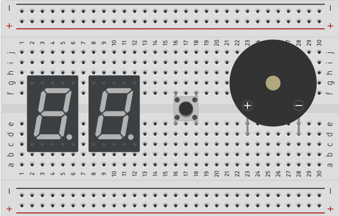

# Digital Dice

> โจทย์ข้อนี้ได้รับแรงบันดาลใจจาก [**Lab 6 - Digital Dice (Digital System Fundamental in Practice)**](https://github.com/Nat-thapas/KMITL-Digital-System/blob/main/Documents/Lab6-2567.pdf) ภาคเรียนที่ 1 ปีการศึกษา 2567

  

## Requirement

ให้ต่อวงจรและเขียนโปรแกรมลงบน Arduino เพื่อจำลองการทำงานของ **ลูกเต๋าดิจิทัล (Digital Dice)** ซึ่งมีรายละเอียดดังต่อไปนี้

### Hardware

- ให้มี Seven-Segments Display (SSD) จำนวน 2 ตัว แทนหลักสิบและหลักหน่วยของตัวเลข ตามลำดับ (สามารถใช้โมดูล Seven-Segements Display ที่มี 2 - 4 หลักแทนได้)
- SSD ทุกตัว ต้องต่อตัวต้านทานและ Common ที่เหมาะสม **มิฉะนั้นจะไม่ตรวจ**
- ให้มี Push Button จำนวน 1 ปุ่ม โดยสามารถต่อแบบ PULLUP หรือ PULLDOWN ก็ได้ โดยเมื่อกดปุ่มจะมีสถานะเป็น HIGH (ไม่อนุญาตให้ต่อแบบ INPUT_PULLUP)
- ให้มี Buzzer 1 ตัว
- Buzzer ทุกตัว ต้องต่อตัวต้านทานที่เหมาะสม **มิฉะนั้นจะไม่ตรวจ**

### Software

- เมื่อเริ่มต้นการทำงาน ให้ SSD แสดงผลเลข 00
- เมื่อกดปุ่มค้างไว้ จะสุ่มตัวเลข (หรือนับเลขก็ได้*) ระหว่าง 00 - 99 และแสดงผลบน SSD ทั้งสอง อย่างรวดเร็ว
- เมื่อปล่อยปุ่ม จะแสดงผลเลขที่สุ่มได้ค้างไว้ที่ SSD ทั้งสองหลัก จนกว่าจะมีการกดปุ่มค้าง เพื่อสุ่มตัวเลขใหม่
- หากสุ่มเลขเสร็จแล้ว (ปล่อยปุ่ม) แล้วเลขที่สุ่มได้ทั้งสองหลักเหมือนกัน เช่น 00, 11, 22, ..., 99 ให้ Buzzer ดังค้างไว้ จนกว่าจะมีการสุ่มตัวเลขใหม่
- Clock ในการสุ่ม (หรือนับ) ตัวเลข ต้องสูงพอจนไม่สามารถมองเห็นตัวเลขด้วยตาเปล่าได้โดยง่าย 

> หมายเหตุ: อ้างอิงจาก Lab 6 - Digital Dice จะเป็นการใช้วงจร Counter นับเลขอย่างรวดเร็ว (เร็วจนเหมือนสุ่ม) เพื่อให้สามารถต่อวงจรและทำงานได้บนบอร์ด FPGA อย่างไรก็ตาม ในการเขียนโปรแกรมลงบน Arduino สามารถใช้ฟังก์ชัน `rand()` เพื่อสุ่มตัวเลขมาแสดงผลได้

> ใน Solution Code ใช้วิธีนับเลข 00 - 99 ตามโจทย์ต้นฉบับบน FPGA